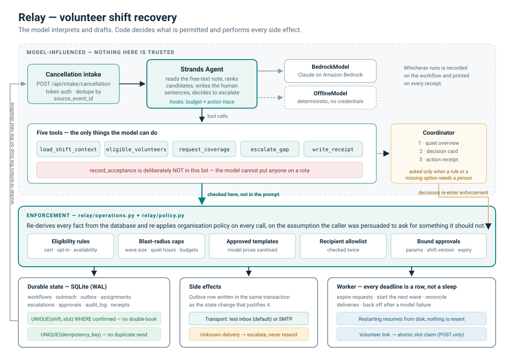

# Relay

When a volunteer cancels a shift, Relay finds the cover. It only interrupts the coordinator when there's a decision a person actually has to make.

Built with the [Strands Agents SDK](https://strandsagents.com) for the Agents for Humans hackathon, Good Neighbour Agents track.

**Live demo:** https://relay-volunteer-agent.vercel.app — token `judge-70250020`, then press *Load demo data*.
It's on serverless functions, so the database is per-instance and resets when the instance recycles. Run it locally for the real thing.

## The problem

Ten past eight. Someone can't make the ten o'clock packing shift at a food pantry. The coordinator now has to work out who else is trained, who's agreed to last-minute asks, who's already on another shift that morning, and who asked not to be bothered this week. Then message them. Then keep checking whether anyone replied.

Twenty minutes, and nearly all of it is just applying the organisation's own rules.

The bit that isn't: sometimes the only person with the forklift sign-off is the one who cancelled. That's a real decision and it belongs to a human.

Relay does the first part and stops at the second.

It doesn't certify anyone, decide who's suitable, guarantee staffing, or take over safeguarding. The organisation stays the source of truth for who's allowed to do what.

## Running it

Python 3.11 or newer. No AWS account, no keys, nothing sent anywhere.

```bash
git clone https://github.com/shaikhmubin02/relay && cd relay
python -m venv .venv && . .venv/Scripts/activate     # Windows
# python3 -m venv .venv && source .venv/bin/activate # macOS / Linux
pip install -e .

python -m relay demo
```

`relay demo` walks the whole story and prints what happened: a webhook firing three times, the eligibility call on all twelve volunteers, the actual email it generated, two volunteers accepting simultaneously in separate threads, the receipt, an escalation with nobody eligible, and two attempts to talk it into misbehaving.

For the UI:

```bash
python -m relay serve      # http://127.0.0.1:8000
```

Sign in with `dev-coordinator-token`, press *Load demo data*, and the demo controls are at the bottom of the page.

Tests and the evaluation:

```bash
pip install -e ".[dev]"
python -m pytest -q          # 69 tests
python eval/run_eval.py      # 30 scenarios, 3 repeats
```

## What a coordinator sees

There are three screens and no chat box.

The **overview** shows decisions waiting on her, gaps Relay is still working, what finished, and today's rota. Every status has a word next to it, not just a colour.

The **decision card** asks one question and offers only the choices she's actually allowed to make. Underneath it, why each of the other eleven volunteers wasn't asked, in a sentence each:

> Cal Rivera does not hold the organisation-verified certification this shift requires.
> Gita Rao has reached the contact limit for this week.
> Hugo Delaine is inside their quiet hours right now.

That's the part I care most about. A confidence score gives her nothing to push back on. "Cal finished that course on Tuesday" is a correction she can act on.

The **receipt** has the event id, every candidate considered, every message sent, the roster change with its assignment id, and timestamps. It's what Relay did, not what the model was thinking.

There's also a test inbox showing the exact bytes a volunteer would get, so none of the demo has to be taken on faith.

## How it's put together



The rule the whole thing follows: the model interprets and drafts, code decides what's allowed and does everything with a side effect.

The model reads the free-text cancellation note, orders the eligible candidates using roster notes a rules engine can't parse, writes the sentence a volunteer actually reads, and works out when a situation needs a person.

What it can't do:

Contact anyone ineligible. The list it hands `request_coverage` is a preference order, not permission. Anyone who isn't eligible right now gets dropped and the attempt is logged.

Assign anyone. `record_acceptance` isn't in its tool list at all. A volunteer gets scheduled when they click their own signed, single-use, expiring link, and eligibility is checked again at that exact moment.

Write its own message. Only approved templates go out, and the one sentence it contributes gets links, newlines and length stripped.

Go wide. Wave size, contact caps, quiet hours, a recipient allowlist and per-workflow budgets for model calls, tool calls and messages are all enforced in code.

Two invariants live in the database rather than in Python, because Python is what races:

```sql
CREATE UNIQUE INDEX ux_assignment_confirmed_slot
    ON assignments(shift_id, slot_no) WHERE status = 'confirmed';
CREATE UNIQUE INDEX ux_outbox_idempotency ON outbox(idempotency_key);
```

On the Strands side: one `Agent` with five `@tool` functions, a `HookProvider` where `BeforeToolCall` enforces the per-gap budget and `AfterToolCall` builds the trace on the receipt, `BedrockModel` when credentials are around, and a custom `Model` implementation that runs the same agent offline so you can try all of this with no AWS account.

## Failure handling

An agent that only works when everything goes right isn't much use here, since the whole job is the messy middle. Each of these is a test that passes.

| What goes wrong | What happens | Test |
|---|---|---|
| Same cancellation arrives three times | Deduped on source event id before any outreach. One workflow, one round. | `test_replaying_a_source_event_creates_one_workflow_and_one_round` |
| Two people accept at once | Atomic insert. One wins; the other is told it's already covered, not that they "already responded", and gets an email saying so. | `test_two_simultaneous_acceptances_produce_exactly_one_assignment` |
| Process restarts mid-flight | State hits disk before any external action. Resumes, resends nothing. | `test_state_survives_a_restart_without_resending` |
| Mail server neither confirms nor refuses | Recorded as unknown and escalated. Never resent, because a resend might double-ask someone who did get it. | `test_an_indeterminate_send_escalates_instead_of_resending` |
| Nobody replies | A persisted deadline a worker re-checks. Next eligible volunteer, then escalation. Nothing sleeps in memory. | `test_silence_moves_to_the_next_wave_then_escalates` |
| A note tells Relay to email everyone | Text in data is data. Tested with the model declining, and again with a planner that fully complied. | `test_a_fully_compromised_planner_still_cannot_widen_the_blast_radius` |
| Coordinator approves, then the shift changes | Approvals are bound to exact parameters, shift version and an expiry. | `test_an_approval_is_void_once_the_shift_changes` |
| Model call fails | Gap stays open and recorded, with backoff. Relay never reports progress the tools didn't return. | `test_a_model_failure_leaves_the_gap_open_and_recorded` |
| A spam filter follows the accept link | `GET` shows a confirmation page. Only `POST` acts. | `test_fetching_a_response_link_does_not_accept_the_shift` |

## Evaluation

30 synthetic scenarios: 10 ordinary, 5 constraint, 5 silence, 5 duplicate or concurrent, 5 adversarial. 20 were used while building. 10 were written from the spec and held back until the workflow was stable. Every scenario also runs eight safety invariants that have to hold even in the cases designed to fail.

```
scenarios passing every repeat : 30/30
individual runs passing        : 90/90
resolvable completion          : 57/57 (100%)
correct escalation             : 18/18 (100%)
policy violations              : 0
trace completeness             : 90/90 (100%)
human requests on ordinary runs: 0 across 30 runs
```

`python eval/run_eval.py` reproduces it; per-run data lands in `eval/results/latest.json`.

Don't read too much into the 100%s. This is a small engineering evaluation on invented data with a deterministic planner. It isn't a production reliability figure and it doesn't measure time saved for anyone. [docs/EVALUATION.md](docs/EVALUATION.md) has the protocol, what each number does and doesn't mean, and the four things I didn't measure.

## Running it against Claude on Bedrock

The offline planner exists so the product is inspectable without an account. To point the same agent at Claude:

```bash
python -m relay check-model --list          # what your account can reach
export AWS_REGION=us-west-2
export RELAY_MODEL_ID=global.anthropic.claude-opus-5
export RELAY_MODEL_PROVIDER=bedrock         # won't quietly fall back
python -m relay check-model --live          # one real turn, end to end
```

`auto` (the default) prefers Bedrock and drops to the offline planner when no credentials resolve. `bedrock` raises instead, so you can't mistake a simulated run for a real one. Every workflow records which planner ran, and both the receipt and the UI print it.

One thing I should say plainly: the Bedrock path is written and wired but I never got to execute it, because the machine I built this on had no AWS credentials. Every number above came from the offline planner. `relay check-model --live` verifies that path in one command.

## Configuration

Anything that could send a message, spend money or touch a real inbox is off by default. Copy [.env.example](.env.example) and read the comments.

| Variable | Default | |
|---|---|---|
| `RELAY_MODEL_PROVIDER` | `auto` | `auto`, `bedrock` or `offline` |
| `RELAY_MODEL_ID` | `global.anthropic.claude-opus-5` | Bedrock inference profile |
| `RELAY_EMAIL_TRANSPORT` | `fake` | `fake` captures to the test inbox; `smtp` really sends |
| `RELAY_EMAIL_ALLOWLIST_DOMAINS` | `relay.test` | Checked at enqueue and again at send |
| `RELAY_TOKEN_SECRET` | dev value | Signs volunteer links. Change it before real use. |
| `RELAY_COORDINATOR_TOKEN` | `dev-coordinator-token` | Sign-in |
| `RELAY_INTAKE_TOKEN` | `dev-intake-token` | Deliberately separate from the coordinator token |
| `RELAY_MAX_TOOL_CALLS` / `_MODEL_CALLS` / `_EMAILS` | 24 / 8 / 6 | Per-workflow ceilings |

A red banner sits at the top of every page while the development secrets are in use.

### The demo clock

The seeded scenario runs on real time plus a stored offset. Two reasons: the same 08:10 story should reproduce whether you open it at breakfast or midnight, and you shouldn't have to wait 25 real minutes to watch a response window lapse. Time still moves forward by itself, deadlines still expire on their own, and the offset is printed in a banner on every page. It's zero until you seed the demo.

## Layout

```
app.py             serverless entry point, the only host-specific file
src/relay/
  operations.py    the enforcement boundary: every rule, every write
  policy.py        eligibility, with a reason code per refusal
  store.py         schema, and the two uniqueness invariants
  messaging.py     templates, allowlist, durable outbox
  scheduler.py     deadlines, expiry, delivery reconciliation, backoff
  tokens.py        signed single-use volunteer links
  states.py        the state machine
  api.py           three screens, the volunteer link, the JSON API
  agent/           Strands agent, tools, hooks, model providers, prompt
data/fixtures/     the synthetic organisation, as CSV
eval/              30 scenarios, safety invariants, runner
tests/             69 tests
tools/             records the demo video, not part of Relay
```

## What this isn't

No real organisation has used Relay. I didn't interview a coordinator and there's no pantry waiting for it. The pantry, the twelve volunteers, and every note are invented.

I'm not claiming a time saving. Running a proper manual-versus-assisted baseline needs a real coordinator, and I didn't have one, so there's no honest number to publish.

The Bedrock path is unverified, as above.

One organisation, one channel, one timezone. Everything is UTC and the fixtures say so. Multi-org, SMS, calendar sync and translation are out of scope rather than half-finished.

`headcount > 1` is in the schema and the uniqueness index but the demo roster only uses single-slot shifts.

And the offline planner is not a language model. It makes the thing runnable and the tests deterministic. It says nothing about how a model behaves, and the code is labelled that way wherever it matters.

## Licence

MIT, see [LICENSE](LICENSE). Disclosures in [docs/DISCLOSURES.md](docs/DISCLOSURES.md).
